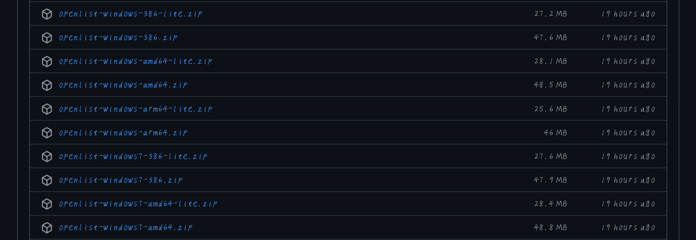
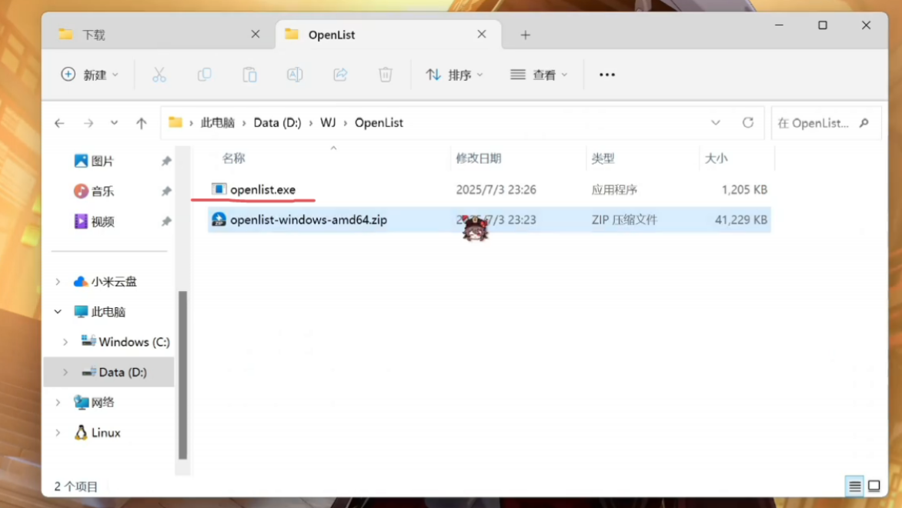
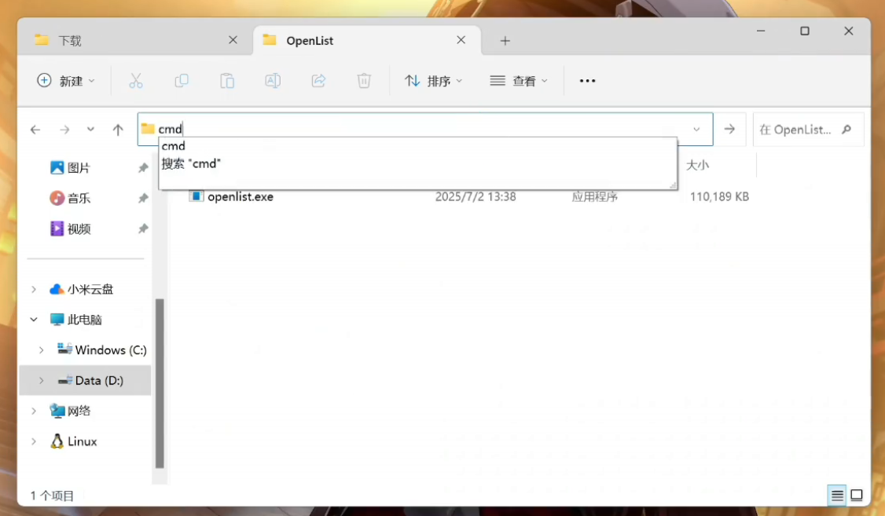
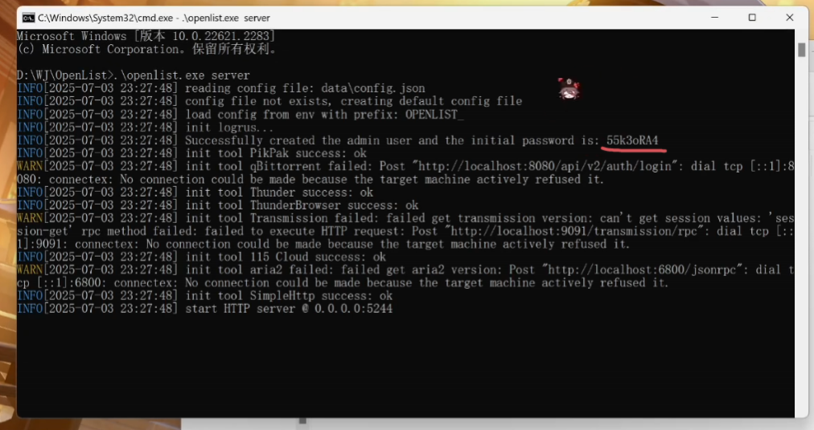
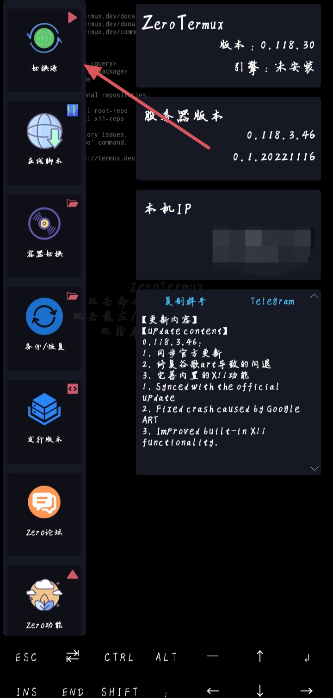
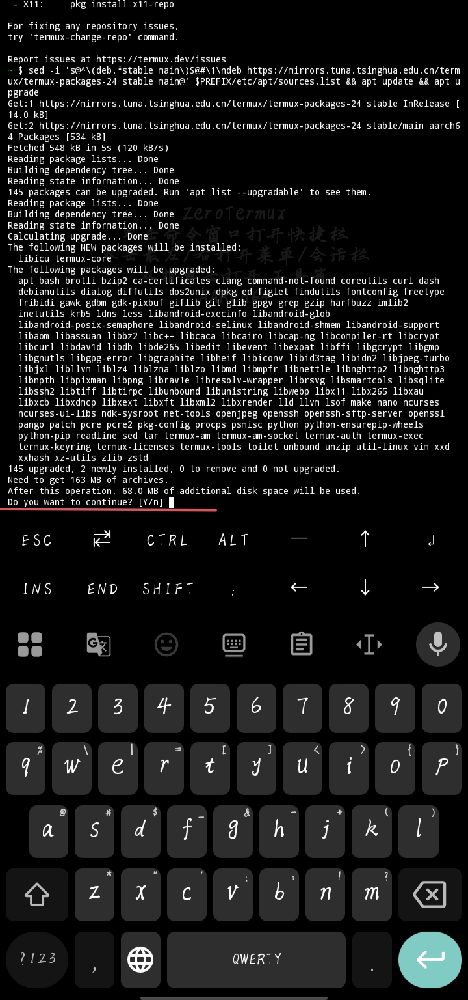
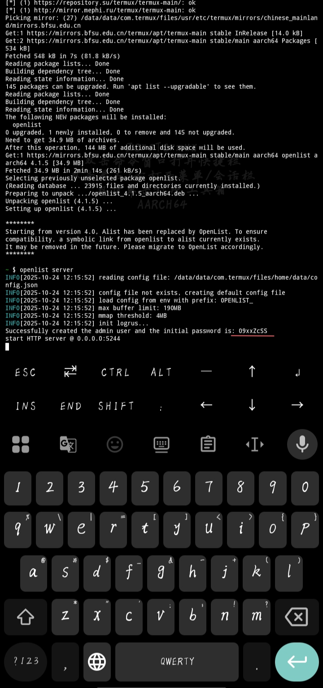
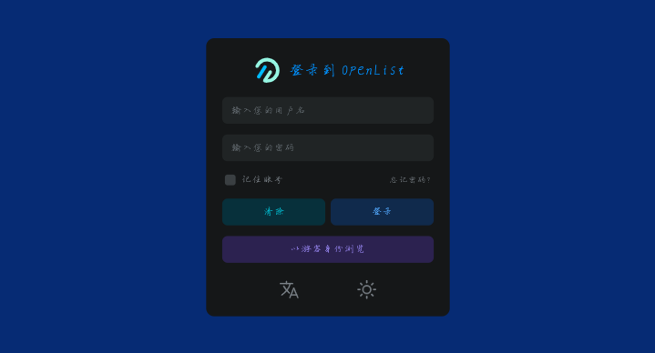
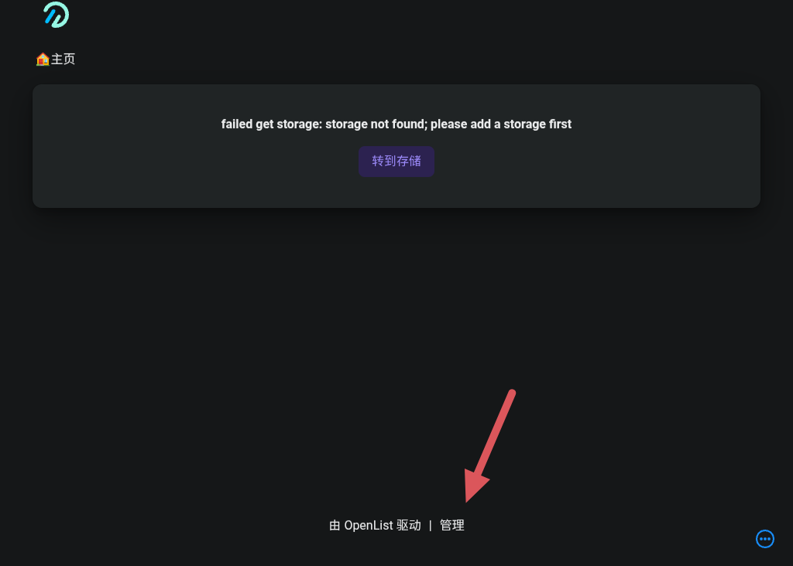
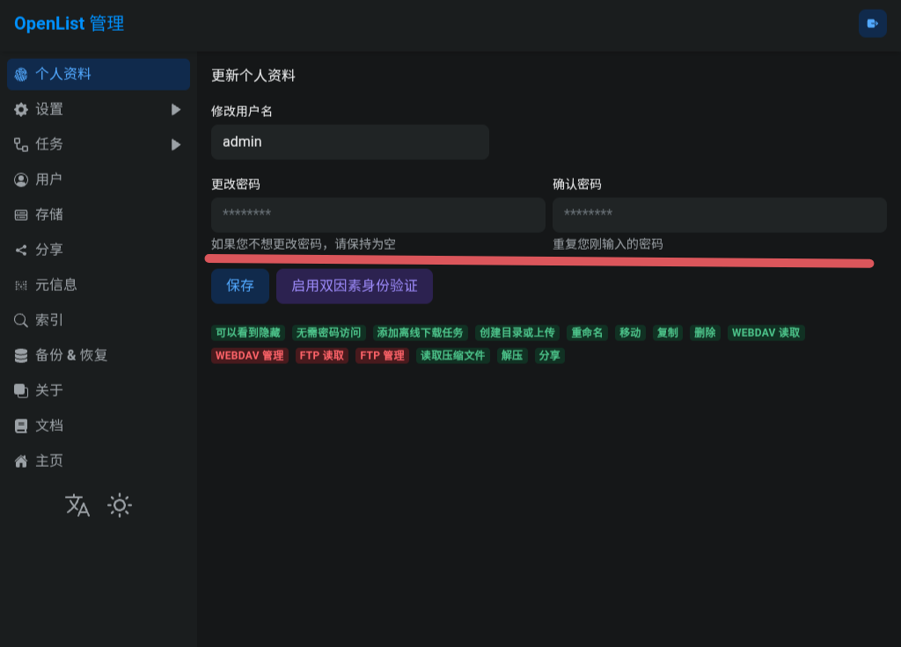

#  OpenList 项目简介

**OpenList** 是一个由社区维护的开源文件管理与分享系统，源自开源项目 **AList** 的分支（Fork），旨在打造一个 **更开放、可持续、自由可控** 的文件目录服务平台。

它提供一个美观、易用的网页界面，让用户能够在浏览器中快速访问、预览和下载来自多种存储源的文件。  

OpenList 支持将不同类型的存储（如本地文件夹、网盘、对象存储、WebDAV 等）统一管理，并通过简单的配置即可实现“文件集中展示”。

---

## 核心功能

- **多存储挂载**：支持本地磁盘、阿里云盘、OneDrive、WebDAV、S3 等多种存储后端。  
- **网页文件浏览**：用户可直接通过网页查看、搜索和下载文件。  
- **文件预览**：支持图片、音视频、PDF、Office 文档、Markdown 等多种格式在线预览。  
- **访问控制**：可设置访问密码、隐藏目录、用户认证等安全措施。  
- **批量与打包下载**：支持将多个文件或整个文件夹一键打包下载。  
- **插件与扩展机制**：支持自定义主题与插件扩展功能。  
- **跨平台部署**：可运行在 Linux、Windows、macOS，也支持 Docker 一键部署。

---

## 项目理念

OpenList 由开发者社区共同维护，遵循 **AGPL-3.0 开源协议**，鼓励任何人自由使用、修改与分发。  
项目致力于：

- 保持开源、透明的开发模式；  
- 提供稳定可持续的文件访问体验；  
- 推动自托管（Self-hosted）文化，让用户完全掌控自己的数据。

---

# 部署教程

## Windows

首先进入openlist的GitHub仓库的[release（点此进入）](https://github.com/OpenListTeam/OpenList/releases)界面
找到你电脑对应的架构下载对应的压缩包
  
然后打开资源管理器找到一个你看得顺眼的目录创建一个名为Openlist的文件夹，把压缩包移动到该目录  
解压压缩包后你会得到一个名为`openlist.exe`的文件
  
在该目录下点资源管理器的路经栏输入cmd然后回车  
  
在cmd中输入
```cmd
.\openlist.exe server
```

第一次运行它会显示默认密码请记住它
  
如果忘记了密码可以用下面的命令重置  
```cmd
.\openlist.exe admin set [新密码]
```

## Linux
打开命令行输入以下命令
```linux
apt install openlist
```
或
```linux
pkg install openlist
```
安装完后输入
```linux
openlist server
```
然后记住默认密码  
如果忘记了密码可以用下面的命令重置  
```linux
openlist admin set [新密码] 
```

## Android
### 有root
首先你要有MT管理器，没有可以去[MT官网](https://mt2.cn)下载  
然后去openlist的GitHub仓库的[release（点此进入）](https://github.com/OpenListTeam/OpenList/releases)界面  
找到对应的Android版本以及架构的压缩包下载  

打开MT管理器创建一个名为openlist的文件夹  
把下好的压缩包移动过去并解压  
然后侧滑打开终端模拟器
:::tip[小提示] 
请确保你已授予MT管理器root权限
:::
cd到openlist文件夹  
输入命令
```linux
su
chmod 777 openlist
./openlist server
```
也是请记住默认密码
如果忘记密码了可以通过命令重置
```linux
./openlist admin set [新密码]
```

### 无root
首先要下载[zero termux](https://github.com/hanxinhao000/ZeroTermux/releases)
打开termux，侧滑打开切换源

选择国内源，例如：清华源和北京源

等待换源成功，如果出现提示输入y回车即可

换完源之后输入
```linux
pkg install openlist
```
安装完后输入
```linux
openlist server
```
第一次启动会有初始密码，请记住它

如果忘记了密码可以用以下命令重置
```linux
openlist admin set [新密码]
```

### 有root与无root的区别
有root可以在后台持续运行，就算是删了mt管理器的后台也可以运行，除非你手机关机
无root要把zerotermux锁后台才可以持续运行

---

# 访问
打开你的浏览器，输入`http://localhost`或`http://127.0.0.1:5244`

用户名：admin  
密码：部署时显示的默认密码  
输入完账号密码后点击登录来到主界面，然后点击管理

可以在管理界面改密码

剩下的绑定网盘的教程可以去参考下方官方文档

---

# 官方资源

- [GitHub仓库](https://github.com/OpenListTeam/OpenList)  
- [官方文档](https://doc.oplist.org)  
- [官网](https://oplist.org)
