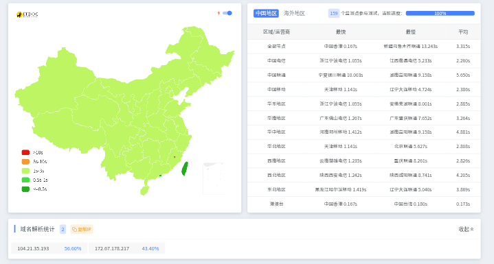
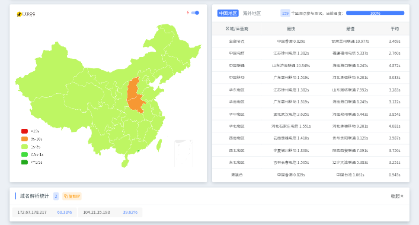
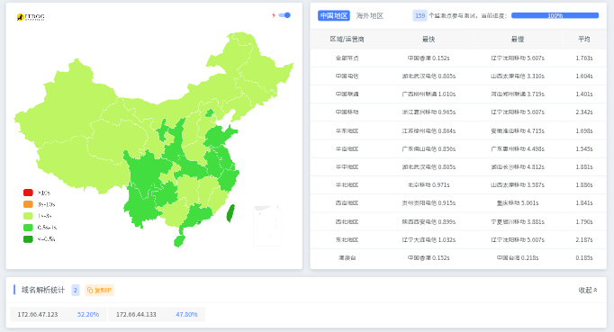
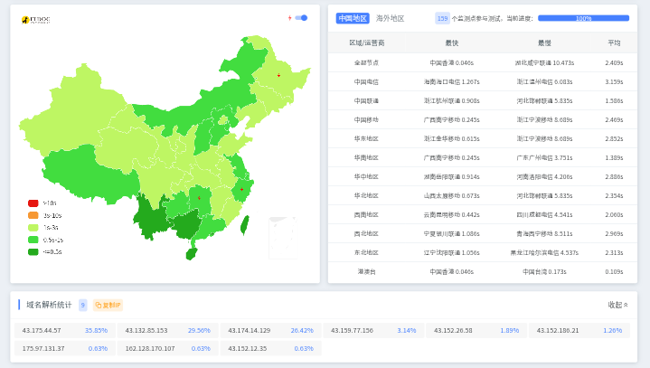
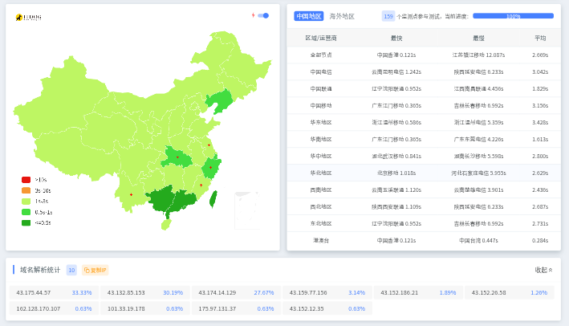
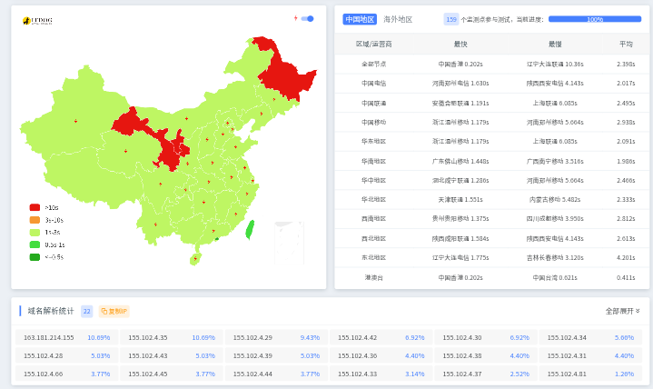
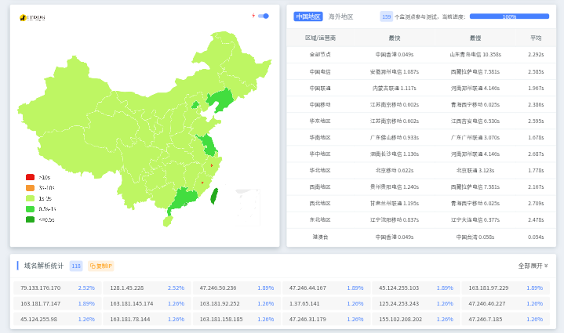
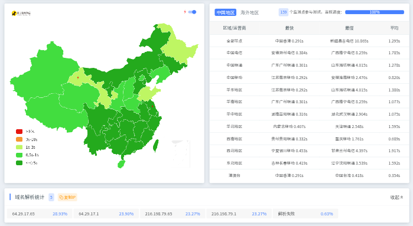
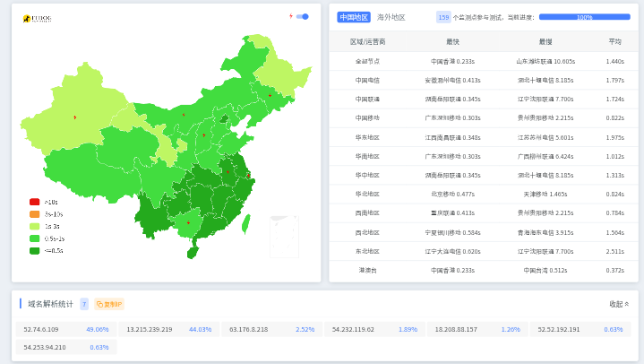

# 免费 CDN / Edge 网站托管平台对比 

随着 Jamstack 与 Serverless 架构的发展，越来越多开发者使用 CDN 与 Edge 平台部署网站。这类平台通常提供全球 CDN 加速、静态网站托管、Serverless 或 Edge Functions、Git 自动部署以及自动 HTTPS 证书。本文介绍多个常见平台，并整理各平台免费套餐资源用量。

---

# CloudFlare CDN、Workers & Pages

## 平台介绍

Cloudflare 是全球最大的网络基础设施公司之一，提供 CDN 加速、DNS、DDoS 防护、WAF、安全访问控制以及边缘计算服务。Cloudflare 在全球 300 多个城市部署了网络节点，网站访问请求可以在全球边缘节点进行缓存和分发，从而降低访问延迟并提高访问速度。

Cloudflare 的开发者平台包括 Workers & Pages。Workers 是一个运行在 Cloudflare 边缘节点上的 Serverless 计算平台，允许开发者使用 JavaScript 或 WebAssembly 编写代码并在边缘执行。开发者可以利用 Workers 构建 API、代理服务、动态页面以及各种边缘逻辑处理服务。  
Pages 是 Cloudflare 提供的静态网站托管平台，可以直接从 Git 仓库自动构建并部署网站。Pages 生成的网站文件会自动通过 Cloudflare CDN 网络进行全球分发。Pages 同时支持 Pages Functions，Functions 基于 Workers 实现，可以在静态网站中加入 API 或动态逻辑。

Cloudflare CDN、Workers 与 Pages 可以组合使用。静态资源通过 CDN 进行缓存和分发，动态请求由 Workers 在边缘节点处理，而前端项目则可以通过 Pages 自动构建并部署。

## 免费套餐

### CDN

|                 | 免费额度   |
| --------------- | ------ |
| CDN 流量          | 不限制    |
| 网站数量            | 不限制    |
| HTTPS           | 免费自动证书 |
| HTTP/2 / HTTP/3 | 支持     |
| DDoS 防护         | 基础防护   |
| WAF             | 基础规则   |
| 缓存控制            | 支持     |
| Page Rules      | 3 条    |
| 自定义缓存规则         | 支持     |

#### 延迟测试

### Workers

|                    | 免费额度          |
| ------------------ | ------------- |
| 请求次数               | 100,000 / 天   |
| Worker 数量          | 100           |
| CPU 时间             | 10 ms / 请求    |
| 最大运行时间             | 30 秒          |
| 内存                 | 128 MB        |
| 子请求                | 50 / 请求       |
| Worker 脚本大小        | 1 MB          |
| KV 读取              | 100,000 / 天   |
| KV 写入              | 1,000 / 天     |
| KV 存储              | 1 GB          |
| Durable Objects 请求 | 100,000 / 天   |
| D1 数据库读取           | 100,000 行 / 天 |
| R2 存储              | 10 GB         |
| R2 请求              | 1,000,000 / 月 |

#### 延迟测试

### Pages

|                  | 免费额度        |
| ---------------- | ----------- |
| Pages 项目         | 500         |
| 构建次数             | 500 / 月     |
| 构建时间             | 3000 分钟 / 月 |
| 构建并发             | 1           |
| Functions 请求     | 100,000 / 天 |
| Functions CPU 时间 | 10 ms       |
| 单次部署大小           | 25 MB       |
| 静态资源 CDN         | 不限制         |
| 自定义域名            | 支持          |
| HTTPS            | 自动证书        |

#### 延迟测试

---

# EO CDN & Pages (海外版)

## 平台介绍

EdgeOne是腾讯推出的全球 CDN 网络服务，用于网站加速、内容缓存以及网络安全防护。EdgeOne 在多个地区部署 CDN 节点，可以通过边缘节点缓存网站内容，从而减少源站压力并提高访问速度。

EdgeOne 平台同时提供静态网站托管服务。EO Pages 可以从 GitHub 等代码仓库自动部署网站，并将构建后的文件通过 EdgeOne CDN 网络进行分发。开发者可以将前端项目直接部署到 Pages，同时绑定自定义域名并启用 HTTPS 证书。

## 免费套餐

### EO CDN

|         | 免费额度 |
| ------- | ---- |
| CDN 流量  | 不限制  |
| 域名数量    | 不限制  |
| HTTPS   | 免费证书 |
| HTTP/2  | 支持   |
| HTTP/3  | 支持   |
| DDoS 防护 | 基础防护 |
| 缓存规则    | 支持   |
| 边缘节点    | 全球节点 |
| 自定义缓存   | 支持   |

#### 延迟测试

### EO Pages

|                    | 免费额度        |
| ------------------ | ----------- |
| Pages 项目           | 50          |
| 构建次数               | 500 / 月     |
| 构建并发               | 1           |
| Edge Functions 请求  | 100,000 / 天 |
| Edge Functions CPU | 10 ms       |
| 单次部署大小             | 100 MB      |
| 单文件大小              | 100 MB      |
| 自定义域名              | 支持          |
| HTTPS              | 自动证书        |

#### 延迟测试

---

# ESA CDN & Pages (海外版)

## 平台介绍

ESA是一个提供 CDN 加速服务的平台，支持网站缓存、HTTPS 加密以及全球节点分发。开发者可以将域名接入 ESA CDN，通过边缘节点缓存静态资源并提升访问速度。

ESA 同时提供静态网站托管平台。Pages 支持通过 Git 仓库自动部署网站，并在部署完成后通过 ESA CDN 节点进行分发。开发者可以在平台中配置构建任务、绑定域名并启用 HTTPS。

## 免费套餐

### ESA CDN

|        | 免费额度 |
| ------ | ---- |
| CDN 流量 | 不限制  |
| 域名数量   | 不限制  |
| HTTPS  | 免费证书 |
| HTTP/2 | 支持   |
| HTTP/3 | 支持   |
| 边缘缓存   | 支持   |
| 缓存规则   | 支持   |
| 节点网络   | 全球节点 |

#### 延迟测试

### ESA Pages

|                    | 免费额度       |
| ------------------ | ---------- |
| Pages 项目           | 20         |
| 构建次数               | 300 / 月    |
| 构建并发               | 1          |
| Edge Functions 请求  | 50,000 / 天 |
| Edge Functions CPU | 10 ms      |
| 单次部署大小             | 50 MB      |
| 单文件大小              | 50 MB      |
| 自定义域名              | 支持         |
| HTTPS              | 自动证书       |

#### 延迟测试

---

# Vercel

## 平台介绍

Vercel 是一个面向前端开发者的网站部署平台，由 Next.js 团队创建。平台提供静态网站托管、Serverless Functions、Edge Functions、全球 CDN 分发以及自动 CI/CD 构建系统。

## 免费套餐

|                         | 免费额度          |
| ----------------------- | ------------- |
| 项目数量                    | 200           |
| 部署次数                    | 100 / 天       |
| 构建并发                    | 1             |
| 构建时间                    | 45 分钟 / 次     |
| Serverless Functions 请求 | 1,000,000 / 月 |
| Serverless 运行时间         | 10 秒          |
| Serverless 内存           | 1024 MB       |
| Edge Functions 请求       | 1,000,000 / 月 |
| Edge Functions 运行时间     | 30 秒          |
| CDN 带宽                  | 100 GB / 月    |
| 静态文件大小                  | 100 MB        |
| Serverless 包大小          | 50 MB         |

#### 延迟测试

---

# Netlify

## 平台介绍

Netlify 是 Jamstack 架构最早流行的网站托管平台之一。平台提供静态网站托管、Serverless Functions、Edge Functions、自动构建部署、表单处理等功能。开发者可以将 GitHub 或 GitLab 仓库连接到 Netlify，当代码更新时平台会自动构建并发布到 CDN 网络。Netlify 在前端开发社区中被广泛使用。

## 免费套餐

|                         | 免费额度          |
| ----------------------- | ------------- |
| 网站数量                    | 不限制           |
| CDN 带宽                  | 100 GB / 月    |
| 构建时间                    | 300 分钟 / 月    |
| 构建并发                    | 1             |
| Serverless Functions 请求 | 125,000 / 月   |
| Serverless 运行时间         | 10 秒          |
| Edge Functions 请求       | 1,000,000 / 月 |
| Edge Functions 运行时间     | 50 ms CPU     |
| 存储                      | 10 GB         |
| 表单提交                    | 100 / 月       |
| 身份认证用户                  | 1000          |
| 自定义域名                   | 支持            |
| HTTPS                   | 自动证书          |

#### 延迟测试

---

# 总结

## CDN

| 平台             | CDN 流量 | 域名数量 | HTTPS | HTTP/3 | DDoS |
| -------------- | ------ | ---- | ----- | ------ | ---- |
| Cloudflare CDN | 不限制    | 不限制  | 支持    | 支持     | 支持   |
| EO CDN         | 不限制    | 不限制  | 支持    | 支持     | 支持   |
| ESA CDN        | 不限制    | 不限制  | 支持    | 支持     | 支持   |
## Pages / Workers / Serverless

| 平台                 | 项目数量       | 构建次数    | Functions 请求 | 构建时间        |
| ------------------ | ---------- | ------- | ------------ | ----------- |
| Cloudflare Pages   | 500        | 500 / 月 | 100k / 天     | 3000 分钟 / 月 |
| Cloudflare Workers | 100 Worker | -       | 100k / 天     | -           |
| EO Pages           | 50         | 500 / 月 | 100k / 天     | 未明确         |
| ESA Pages          | 20         | 300 / 月 | 50k / 天      | 未明确         |
| Vercel             | 200        | 100 / 天 | 1M / 月       | 45 分钟 / 次   |
| Netlify            | 不限制        | -       | 125k / 月     | 300 分钟 / 月  |

---

# 各个平台注册链接

- [CloudFlare](https://dash.cloudflare.com/sign-up)
- [EdgeOne(国际站)](https://edgeone.ai/)
- [ESA(国际站)](https://www.alibabacloud.com/en/product/esa?_p_lc=1)
- [Vercel](https://vercel.com/)
- [Netlify](https://www.netlify.com/)